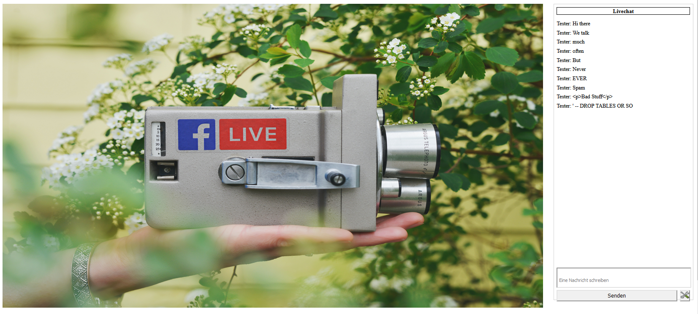
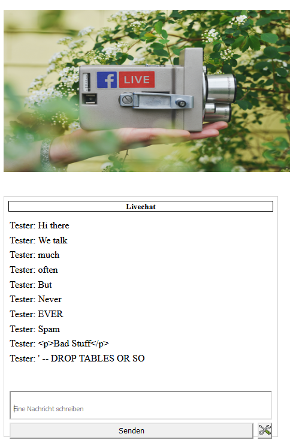
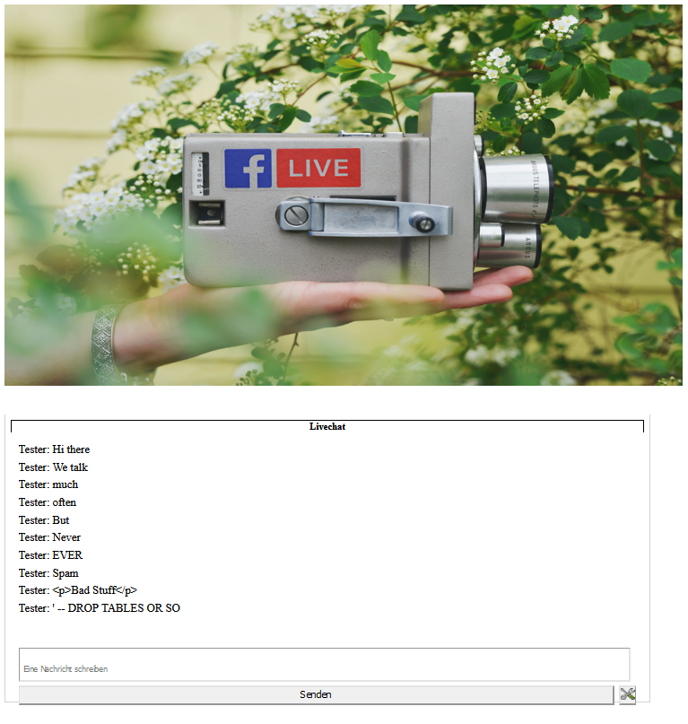

# Embeddable WebLiveChat

Hi everyone :) This is cool little, twitch-like live chat. Actually I was hoping that somebody else had already build this… 
But I wasn’t able to find any repositories which is why we are here now.
**The main idea is to provide a live chat that can be used together with some embedded video or stream!**

Desktop
:---:

Mobile | iPad
:--------:|:-------------:
 | 

## What it can do:

- Responsive combination of an iframe together with a live chat
- Easy to understand and get started
- Usable with WordPress (some Plugins might be needed)
- Unlimited Users
- Spam Protection
- User blocking
- Message deleting
- Loooots of customization possibilities 

## What it requires:
- PHP and SQL Server
- Any way to execute a javascript init method
- Translation from germen to the needed language
- Some patience. Maybe.

## Installation
- Download repository, unzip und copy to your webserver environment
- Connect to SQL server and run webserver/livechat.sql to create new database “livechat”
- Change connection details for SQL server in webserver/resources/pwd.php
- Change admin password in webserver/admin/index.php line 54 (default is “admin” & “password”)
- Open index.html in your browser and validate that the empty chat shows up correctly
- Copy code snippets from index.hmtl to whereever you want to use the chat. (Remember that the generated HTML code still needs the other files in the same directory later!)

## Errors
When I open the index.html the chat shows the “Please enter your name” stuff instead of the empty chat..?  
&rarr; It seems like the initLiveChat(); does not get called. 

I can’t send or receive messages..?  
&rarr; Check connection to SQL Server. Use browser utilities to check if HTTP Request are send correctly

Messages sometimes show of two times. Mainly on mobiles.  
&rarr; Known bug. Is now a feature. Can’t be fixed. I don’t know how. 

It does not look like in the image at all!  
&rarr; Start firefighting the horrible CSS code. Sorry :) 

I can’t lick my elbow.  
&rarr; Try harder!

## How to use
When the website is loaded all messages from the last 3 hours are shown. When a new User sees the live chat for the first time he/she usually types in a message and wants to sent it. When clicking on “Senden”/”Send” the name menu will show up. If the user has typed in the name he/she can finally sent the message. The browser will remember that username for 30 days (cookie). If the user wants to change his/her name he/she can click the menu icon at the bottom right of the live chat. 

## Protection
Every User can send up to messages every five seconds. To increase the spam protection, change maxMessages in webserver/java.js line 6 to whatever is needed.
WARNING The system is vulnerable for DDOS. The spam filter only applies to the live chat in the browser directly. The system can be exploited when multiple HTTP Post messages are sent directly to the reqmsgs.php. The PHP code won’t provide any protection from spam. The Javascript code will show all messages from the last 3 hours: 10, 100 or 100.000 messages will be loaded directly to the browser of every connected user. In rare cases this may lead to an extreme curvature of space-time and eventually collapse into a black hole double the size of 3 football fields. 
Deleting messages
Using the webserver/admin/index.php you can delete all message not older than 4 hours. 

## Blocking Users
Using the webserver/admin/index.php you can block a user who wrote a message during the last 4 hours. This ban is on IP level. **Remember that to do so you will store the IPv4 address of all users in your DB. CHECK LOCAL REGULATION.**  

## Questions?
Please create an issue for any question, thanks!

